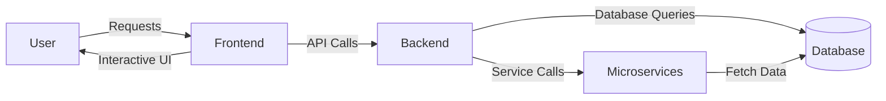

# Fly.io Hosting Plan Documentation

## Overview
This document details the architecture of the enterprise platform hosted on Fly.io, including components, interactions, and deployment strategies.

## Architecture Diagram

## Components
1. **User Interface**: The entry point for users to interact with the application.
2. **Frontend**: Built using modern frameworks (e.g., React) that communicate with the backend API.
3. **Backend**: Handles business logic, authentication, and data processing.
4. **Database**: Stores user and operational data, serves queries from the backend.
5. **Microservices**: Independent services that perform specific functions and communicate via APIs.

## Deployment Strategy
- **Isolation**: Each team deploys to isolated Fly.io machines to ensure security and performance.
- **Scalability**: Services can be scaled independently based on load.

## Conclusion
This document provides the foundational layout for understanding the architecture hosted on Fly.io, aiding in future scalability and development efforts.